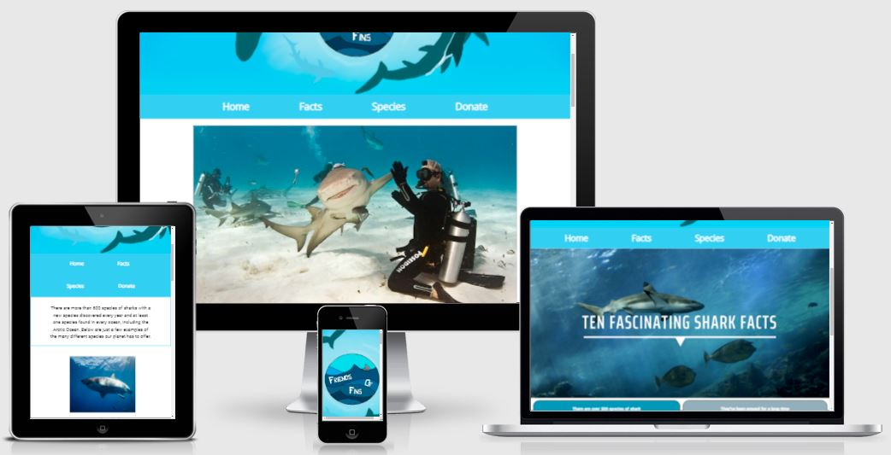
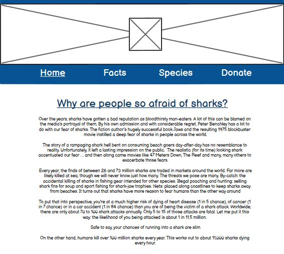
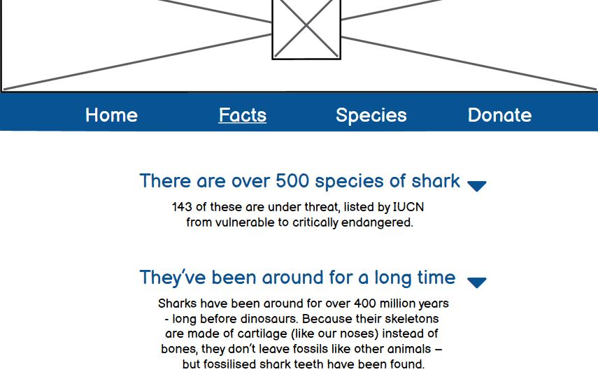
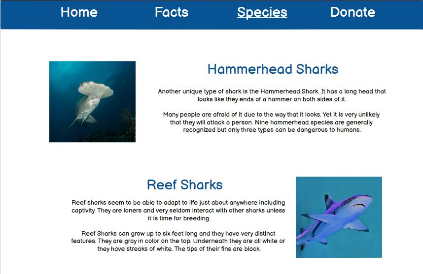
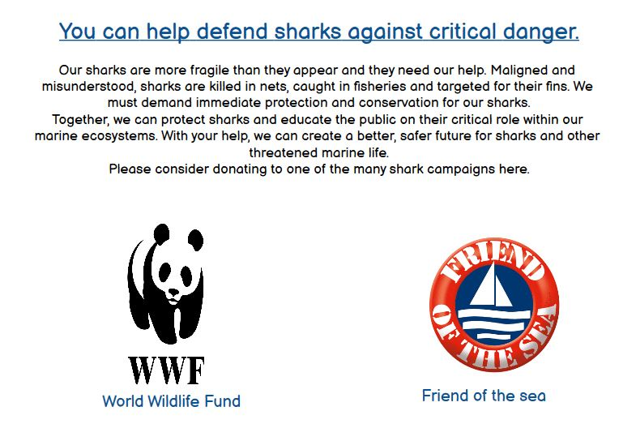
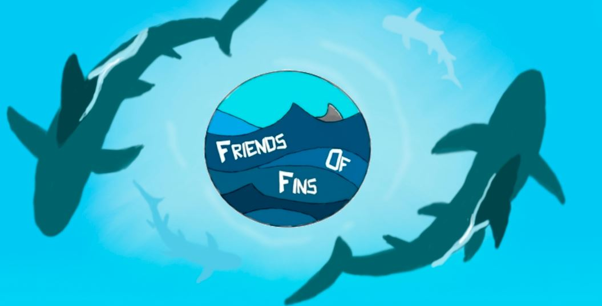
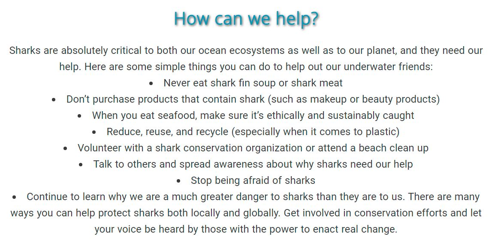
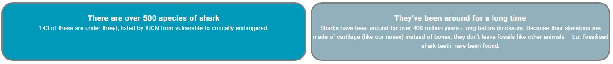
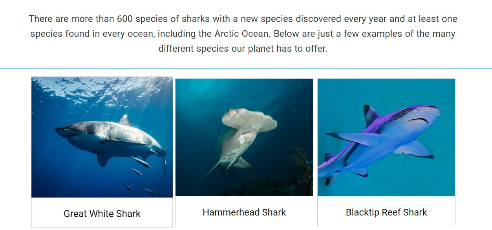
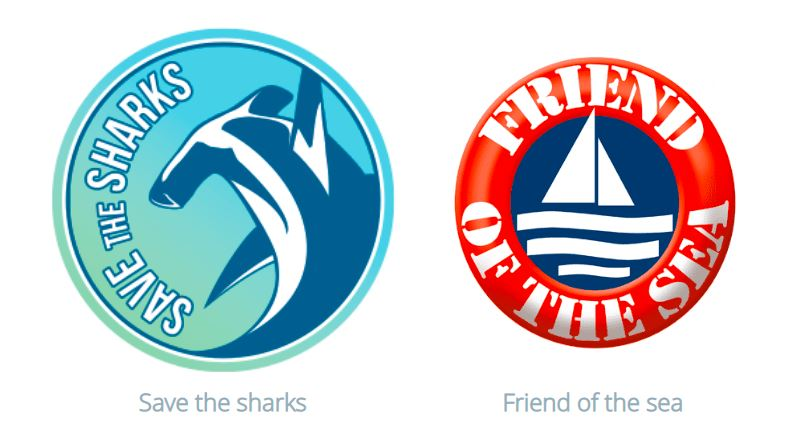

User Experience
======

### Target Audience
<ul> 
<li>School-aged children, to be used as an educational resource</li>
<li>Targeted at people who would like to expand their knowledge on marine life</li>
<li>People potentially looking to donate towards shark conservation</li>
</ul>

### User Requirements
<ul>
<li>A simple and efficient navigation system, suitable for any age</li>
<li>Bright and eye-catching presentation</li>
<li>Good accessibility</li>
<li>High quality photos and fuctioning videos</li>
<li>Clickable links that lead to external sites for more information</li>
<li>Factual information from reliable sources</li>
<li>A trustworthy source of information regarding donating</li>
</ul>

### User Stories

#### First-time User 
<ul>
<li>I want to easily understand the main purpose of the site and learn more about the dangers sharks are facing</li>
<li>I want to know I can trust any information provided by the website</li>
<li>I want the site to be visually appealing</li>
<li>I want corresponding links that lead to social media and donation pages</li>
</ul>

#### Returning User
<ul>
<li>I want to see more shark facts</li>
<li>I want to see a broader range of shark species and some information about any breed listed</li>
<li>I want more information regarding donating and information about the causes and a place to donate via the site</li>
<li>I want to be able to provide feedback about the site and submit any suggestions I might have that I would like to see added to the site</li>
<li>I want to see more social media and youtube links to help me connect to the community involved with shark conservation</li>
<li>I want to see more photos and videos of the work that is being undergone to help conserve sharks in the wild</li>
</ul>

Design
======

### Structure

The site is designed and structured in a way that is user friendly, easy to navigate and eye-catching. Upon clicking into the site, the user is greeted with a fun, colourful display and a centred logo and a navigation bar, containing four separate pages.

A home page containing an introduction to what the site is about and relevant information regarding sharks.

A facts page filled with 10 interesting facts.

A species page containing a gallery.

A donation page with relevant, trustworthy links to donate.

### Typography

Open sans was used as a heading and Roboto was used for text. Both fonts were found on Googlefonts and they compliment each other in attractive way that works well throughout the site

### Wireframes

Homepage

Fact page

Species page

Donate page

Features
======

### Navigation Bar
<ul>
<li>Featured on all 4 webpages</li>
<li>Aids visiters in accessing information</li>
<li>Utilizes hyperlinks to navigate visitors</li>
</ul>

### Hero and Logo image
<ul>
<li>Featured on all 4 webpages</li>
<li>Visually communicates the identity of the site and what it represents</li>
<li>A symbol for customers to recognise the organisation</li>
</ul>

### Home Page
<ul>
<li>Displays the main focus of the site which is to educate people about the dangers sharks are in</li>
<li>Piques the interests of visiters to give them a overall impression of what the organisations is working for</li>
</ul>

### The Footer
<ul>
<li>Adds navigation options to the bottom of the webpage</li>
<li>Featured on all 4 pages</li>
<li>Consists of links to the main social media platforms</li>
</ul>

### Facts Page
<ul>
<li>Provides educational information in a fun to learn way</li>
<li>Full of eye catching colors to keep visiters attention</li>
</ul>

### Species Page
<ul>
<li>Allows visiters to see different breeds of sharks in a striking layout</li>
</ul>

### Donate Page
<ul>
<li>Provides users with links for different charities for people to donate to their cause of choice</li>
<li>Raises awareness about the vast amount of organisations commited to helping sharks</li>
</ul>

### Future features to implement
<ul>
<li>Plan to create corresponding social media sites and link them in the footer</li>
<li>Plan to link and provide information to local services that aid sharks and marine life in emergencies</li>
</ul>

Testing
======

## Vaildator Testing

### Html
No errors were returned when passing through the official W3C validator

### Css
No errors were found when passing through the official (Jigsaw) validator

### Fixed Bugs
Encountered issues on mobile screens with sizing but was able to correct it by changing the viewport

Deployment
======

The site was deployed to GitHub pages. The steps to deploy are as follows:

In the GitHub repository, navigate to the Settings tab

From the source section drop-down menu, select the Master Branch

Once the master branch has been selected, the page will be automatically refreshed with a detailed ribbon display to indicate the successful deployment.

The live link can be found here - https://magq98.github.io/friends-of-fins/index.html

Credits
======

Images not referenced below are owned by the developer.

### Content

https://www.fisheries.noaa.gov/feature-story/12-shark-facts-may-surprise-you

https://www.wwf.org.uk/learn/fascinating-facts/sharks

https://kidsanimalsfacts.com/saw-shark-facts-for-kids/#:~:text=Sharks-,

Saw%20Shark%20Facts%20for%20Kids,do%20not%20have%20anal%20fins.

https://www.marineconservation.org.au/actions/donate-sharks/#:~:text=We%20must%20deman

### Media

https://www.labroots.com/trending/plants-and-animals/443/high-five-from-a-shark

https://www.pexels.com/

https://unsplash.com/

https://codepen.io/brianacamp/pen/QWWOwdM

### Acknowledgements

My mentor and tutor for continuous helpful feedback